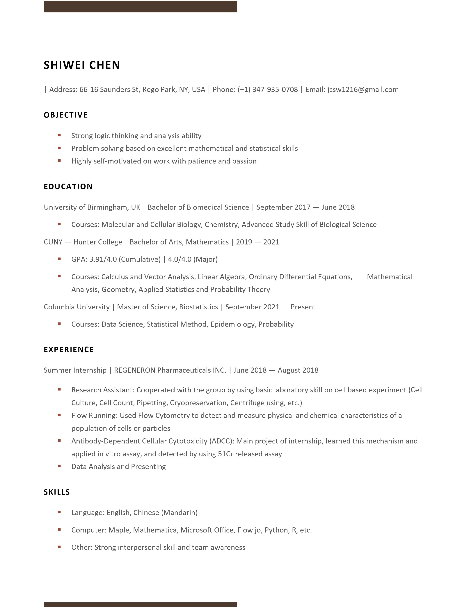

# This page has more information about me

I graduated from City university of New York-Hunter college, my major is Math.

I am taking my master program of Biostatistics in the Columbia university-Mailman school of public health.

## My contact

E-mail address:

Academic: sc4935@cumc.columbia.edu

Personal: jcsw1216@gmail.com

## My resume

## My links

These are links about me:

* [Linkedin](https://www.linkedin.com/in/shiwei-chen-gic942)

* [Github](https://github.com/gic94)

